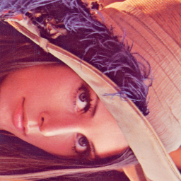

# Computer Vision in C & Verilog
In this repository there are some computer vision algorithms implemented using C and Verilog

## Table of Contents
* [Table of Contents](#table-of-contents)
* [Overview](#overview)
* [Contents](#contents)
    + [Load Image](#load-image)
    + [BGR to Gray](#bgr-to-gray)
    + [Rotate Image](#rotate-image)
* [Tools](#tools)

## Overview
|[Load Image](./load_image/README.md)|[BGR to Gray](./bgr_to_gray/README.md)|[Rotate Image](./rotate_image/README.md)|
|-|-|-|
||||

## Contents
### Load Image
Read image from BMP (bitmap) file , and then write it into another.

More

| Input                   | Output                  |
| ----------------------- | ----------------------- |
|  |  |

### BGR to Gray
Read image from BMP (bitmap) file , and then convert it (BGR image) to grayscale.

More

| Input                   | Output                       |
| ----------------------- | ---------------------------- |
|  |  |

### Rotate Image
Read image from BMP (bitmap) file , and then rotate it in 90 degree (clockwise).

More

| Input                   | Output                         |
| ----------------------- | ------------------------------ |
|  |  |

## Tools
* GNU Compiler Collection
* Icarus Verilog
* GTKWave