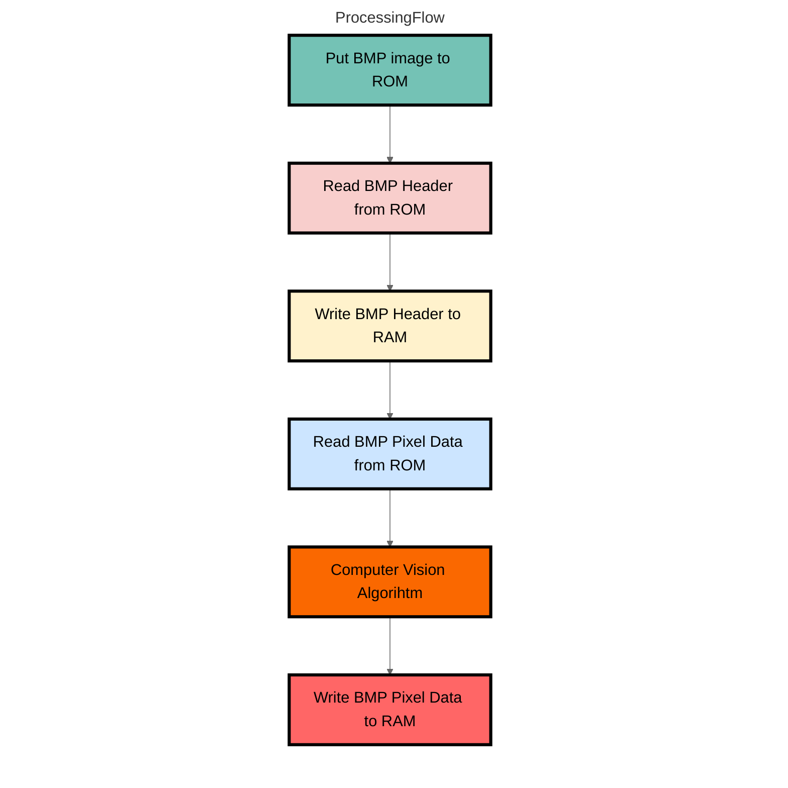

# Image Processing in C & Verilog
In this repository there are some image processing algorithms implemented using C and Verilog, and then use Python3 to compare the result whether there is any difference.

## Table of Contents
* [Table of Contents](#table-of-contents)
* [Contents](#contents)
    + [Load Image](#load-image)
    + [RAW to BGR](#raw-to-bgr)
    + [RAW to Gray](#raw-to-gray)
    + [BGR to Gray](#bgr-to-gray)
    + [Binarization](#binarization)
    + [Image Vertical Flip](#image-vertical-flip)
    + [Image Dilation](#image-dilation)
    + [Image Erosion](#image-erosion)
    + [Connected Components](#connected-components)
    + [Image Histogram](#image-histogram)
    + [Histogram Equalization](#histogram-equalization)
    + [Mean Filter](#mean-filter)
    + [Median Filter](#median-filter)
    + [Gaussian Blur Filter](#gaussian-blur-filter)
    + [Sobel Filter](#sobel-filter)
    + [Laplacian Filter](#laplacian-filter)
* [Image Processing Flow](#image-processing-flow)
* [Tools](#tools)

## Contents
### [Load BMP Image](./load_bmp_image/README.md)
Read image from BMP (bitmap) file, and then write it into another.

More

| Input                   | Output                  |
| ----------------------- | ----------------------- |
|  |  |

### [RAW to BGR](./raw_to_bgr/README.md)
Convert 8-bit-per-channel RGB interleaved RAW (`256×256×3` bytes) to 24-bit BGR BMP. After packing pixels, applies the same **vertical flip** (row swap) as [Image Vertical Flip](#image-vertical-flip) so the result matches BMP scan order (avoids upside-down output).

More

| Input                   | Output                       |
| ----------------------- | ---------------------------- |
| `lena256_rgb.raw` |  |

### [RAW to Gray](./raw_to_gray/README.md)
Read 8-bit grayscale RAW (`256×256` bytes) and write 24-bit BMP with B=G=R per pixel (same visual style as BGR→Gray output). Uses the same **vertical flip** as [Image Vertical Flip](#image-vertical-flip) for correct BMP orientation.

More

| Input                   | Output                       |
| ----------------------- | ---------------------------- |
| `lena256_gray.raw` |  |

### [BGR to Gray](./bgr_to_gray/README.md)
Read image from BMP (bitmap) file, and then convert it (BGR image) to grayscale.

More

| Input                   | Output                       |
| ----------------------- | ---------------------------- |
|  |  |

### [Binarization](./binarization/README.md)
Read image from BMP (bitmap) file, and then convert it (BGR image) to grayscale. Finally, set pixels to white or black determined by threshold.

More

| Input                   | Output (threshold: 8'd127)           |
| ----------------------- | ------------------------------------ |
|  |  |

### [Image Vertical Flip](./image_vertical_flip/README.md)
**Vertical flip** (swap top and bottom rows of the raster). This is not left–right mirroring; it matches the row reordering needed when RAW is scanned top-down but BMP stores the first row as the **bottom** of the image.

More

| Input                   | Output (flipped)             |
| ----------------------- | ---------------------------- |
|  |  |

### [Image Dilation](./image_dilation/README.md)
Apply 3x3 dilation on a binarized grayscale image.

More

| Input                   | Output (3×3 dilation)        |
| ----------------------- | ---------------------------- |
|  |  |

### [Image Erosion](./image_erosion/README.md)
Apply 3x3 erosion on a binarized grayscale image.

More

| Input                   | Output (3×3 erosion)         |
| ----------------------- | ---------------------------- |
|  |  |

### [Connected Components](./connected_components/README.md)
Label connected components (4-connectivity) on a binarized image.

More

| Input                   | Output (4-connectivity)      |
| ----------------------- | ---------------------------- |
|  |  |

### [Image Histogram](./image_histogram/README.md)
Compute grayscale histogram and render it as a BMP.

More

| Input                   | Output (histogram BMP)       |
| ----------------------- | ---------------------------- |
|  |  |

### [Histogram Equalization](./histogram_equalization/README.md)
Equalize grayscale histogram to enhance contrast.

More

| Input                   | Output                       |
| ----------------------- | ---------------------------- |
|  |  |

### [Mean Filter](./mean_filter/README.md)
Read image from BMP (bitmap) file, and then use mean filter to blur image.

More

| Input                         | Output (filter size: 3) |
| ----------------------------- | ----------------------- |
|  |  |

### [Median Filter](./median_filter/README.md)
Read image with salt and pepper noise from BMP (bitmap) file, and then use median filter to remove noise.

More

| Input                         | Output (filter size: 3) |
| ----------------------------- | ----------------------- |
|  |  |

### [Gaussian Blur Filter](./gaussian_blur_filter/README.md)
Apply a 3x3 Gaussian blur on a grayscale image.

More

| Input                   | Output (3×3 Gaussian)        |
| ----------------------- | ---------------------------- |
|  |  |

### [Sobel Filter](./sobel_filter/README.md)
Detect edges with Sobel operator on a grayscale image.

More

| Input                   | Output                       |
| ----------------------- | ---------------------------- |
|  |  |

### [Laplacian Filter](./laplacian_filter/README.md)
Detect edges with 3x3 Laplacian operator on a grayscale image.

More

| Input                   | Output (3×3 Laplacian)       |
| ----------------------- | ---------------------------- |
|  |  |

## Image Processing Flow

```mermaid
%%{
  init: {
    'theme': 'neutral',
    'themeVariables': {
      'textColor': '#000000',
      'noteTextColor' : '#000000',
      'fontSize': '20px'
    }
  }
}%%

flowchart LR
    b0[                  ] --- b2[ ] --- b4[ ] --- ProcessingFlow --- b1[ ] --- b3[ ] --- b5[                  ]
    style b0 stroke-width:0px, fill: #FFFFFF00, color:#FFFFFF00
    style b1 stroke-width:0px, fill: #FFFFFF00
    style b2 stroke-width:0px, fill: #FFFFFF00
    style b3 stroke-width:0px, fill: #FFFFFF00
    style b4 stroke-width:0px, fill: #FFFFFF00
    style b5 stroke-width:0px, fill: #FFFFFF00, color:#FFFFFF00

    linkStyle 0 stroke-width:0px
    linkStyle 1 stroke-width:0px
    linkStyle 2 stroke-width:0px
    linkStyle 3 stroke-width:0px
    linkStyle 4 stroke-width:0px
    linkStyle 5 stroke-width:0px
    
    subgraph ProcessingFlow
    direction TB
    style ProcessingFlow fill:#ffffff00, stroke-width:0px

    direction TB
        A[Put BMP image to ROM]
        A --> B[Read BMP Header from ROM]
        B --> C[Write BMP Header to RAM]
        C --> D[Read BMP Pixel Data from ROM]
        D --> E[Computer Vision Algorihtm]
        E --> F[Write BMP Pixel Data to RAM]
        style A fill:#74c2b5,stroke:#000000,stroke-width:4px
        style B fill:#f8cecc,stroke:#000000,stroke-width:4px
        style C fill:#fff2cc,stroke:#000000,stroke-width:4px
        style D fill:#cce5ff,stroke:#000000,stroke-width:4px
        style E fill:#fa6800,stroke:#000000,stroke-width:4px
        style F fill:#ff6666,stroke:#000000,stroke-width:4px
    end
```

## Tools
* GNU Compiler Collection
* Icarus Verilog
* GTKWave
* Python3