# Image Processing in C & Verilog
In this repository there are some image processing algorithms implemented using C and Verilog, and then use Python3 to compare the result whether there is any difference.

## Table of Contents
* [Table of Contents](#table-of-contents)
* [Contents](#contents)
    + [Load Image](#load-image)
    + [RAW to BGR](#raw-to-bgr)
    + [RAW to Gray](#raw-to-gray)
    + [Image Downscaling](#image-downscaling)
    + [Planar BGR buffer](#planar-bgr-buffer)
    + [Planar gray buffer](#planar-gray-buffer)
    + [BGR to Gray](#bgr-to-gray)
    + [Binarization](#binarization)
    + [Image Vertical Flip](#image-vertical-flip)
    + [Image Horizontal Flip](#image-horizontal-flip)
    + [Image Dilation](#image-dilation)
    + [Image Erosion](#image-erosion)
    + [Connected Components](#connected-components)
    + [Image Histogram](#image-histogram)
    + [Histogram Equalization](#histogram-equalization)
    + [Mean Filter](#mean-filter)
    + [Median Filter](#median-filter)
    + [Gaussian Blur Filter](#gaussian-blur-filter)
    + [Sobel Filter](#sobel-filter)
    + [Laplacian Filter](#laplacian-filter)
* [Quick Test](#quick-test)
* [Batch synthesis (Design Compiler)](#batch-synthesis-design-compiler)
* [Image Processing Flow](#image-processing-flow)
* [Tools](#tools)

## Contents
### [Load BMP Image](./load_bmp_image/README.md)
Read image from BMP (bitmap) file, and then write it into another.
<details>
<summary>More</summary>

| Input                   | Output                  |
| ----------------------- | ----------------------- |
|  |  |

</details>

### [RAW to BGR](./raw_to_bgr/README.md)
Convert 8-bit-per-channel RGB interleaved RAW (`256×256×3` bytes) to 24-bit BGR BMP. After packing pixels, applies the same **vertical flip** (row swap) as [Image Vertical Flip](#image-vertical-flip) so the result matches BMP scan order (avoids upside-down output).

<details>
<summary>More</summary>

| Input                   | Output                       |
| ----------------------- | ---------------------------- |
| `lena256_rgb.raw` |  |

</details>

### [RAW to Gray](./raw_to_gray/README.md)
Read 8-bit grayscale RAW (`256×256` bytes) and write 24-bit BMP with B=G=R per pixel (same visual style as BGR→Gray output). Uses the same **vertical flip** as [Image Vertical Flip](#image-vertical-flip) for correct BMP orientation.

<details>
<summary>More</summary>

| Input                   | Output                       |
| ----------------------- | ---------------------------- |
| `lena256_gray.raw` |  |

</details>

### [Image Downscaling](./image_downscaling/README.md)
Downscale **256×256** → **128×128** by **2×2 box averaging** each BGR channel (same rounding as RTL). BMP header fields are rewritten for the smaller image.

<details>
<summary>More</summary>

| Input                   | Output (128×128)             |
| ----------------------- | ---------------------------- |
|  |  |

</details>

### [Planar BGR buffer](./planar_bgr/README.md)
**BMP_ROM → planar B/G/R SRAMs → `PLANAR_ALGO_BGR_IDENTITY` (or custom) → BGR merge → output RAM → BMP file.** 24 bpp file order is B,G,R. TB mux priority: **LOAD > ALGO > MERGE read**.

<details>
<summary>More</summary>

| Input | Output |
| ----- | ------ |
|  |  |

</details>

### [Planar gray buffer](./planar_gray/README.md)
Same **planar pipeline** as `planar_bgr`: load → **`PLANAR_GRAY_ALGO_IDENTITY`** → merge. One gray plane \(Y=(30B+150G+76R)\gg 8\), then **B=G=R=Y** to 24 bpp output. RTL: **`make vs_rtl`** (VCS).

<details>
<summary>More</summary>

| Input | Output |
| ----- | ------ |
|  |  |

</details>

### [BGR to Gray](./bgr_to_gray/README.md)
Read image from BMP (bitmap) file, and then convert it (BGR image) to grayscale.

<details>
<summary>More</summary>

| Input                   | Output                       |
| ----------------------- | ---------------------------- |
|  | 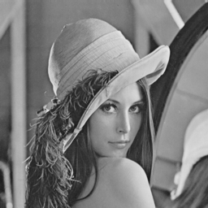 |

</details>

### [Binarization](./binarization/README.md)
Read image from BMP (bitmap) file, and then convert it (BGR image) to grayscale. Finally, set pixels to white or black determined by threshold.

<details>
<summary>More</summary>

| Input                   | Output (threshold: 8'd127)           |
| ----------------------- | ------------------------------------ |
|  | 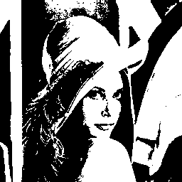 |

</details>

### [Image Vertical Flip](./image_vertical_flip/README.md)
**Vertical flip** (swap top and bottom rows of the raster). This is not left–right mirroring; it matches the row reordering needed when RAW is scanned top-down but BMP stores the first row as the **bottom** of the image.

<details>
<summary>More</summary>

| Input                   | Output (flipped)             |
| ----------------------- | ---------------------------- |
|  | 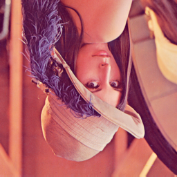 |

</details>

### [Image Horizontal Flip](./image_horizontal_flip/README.md)
**Horizontal flip** (left–right mirror): each row’s BGR pixels are reversed. Unlike vertical flip, row order is unchanged.

<details>
<summary>More</summary>

| Input                   | Output (mirrored)        |
| ----------------------- | ------------------------ |
|  | 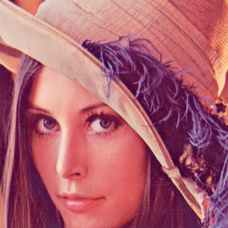 |

</details>

### [Image Dilation](./image_dilation/README.md)
Apply 3x3 dilation on a binarized grayscale image.

<details>
<summary>More</summary>

| Input                   | Output (3×3 dilation)        |
| ----------------------- | ---------------------------- |
|  | 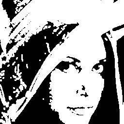 |

</details>

### [Image Erosion](./image_erosion/README.md)
Apply 3x3 erosion on a binarized grayscale image.

<details>
<summary>More</summary>

| Input                   | Output (3×3 erosion)         |
| ----------------------- | ---------------------------- |
|  | 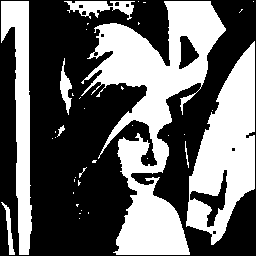 |

</details>

### [Connected Components](./connected_components/README.md)
Label connected components (4-connectivity) on a binarized image.

<details>
<summary>More</summary>

| Input                   | Output (4-connectivity)      |
| ----------------------- | ---------------------------- |
|  | 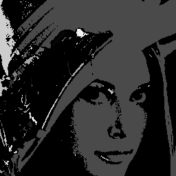 |

</details>

### [Image Histogram](./image_histogram/README.md)
Compute grayscale histogram from a **grayscale** 24-bit BMP (`lena256.bmp`, B=G=R) and render it as a BMP.

<details>
<summary>More</summary>

| Input                   | Output (histogram BMP)       |
| ----------------------- | ---------------------------- |
|  | 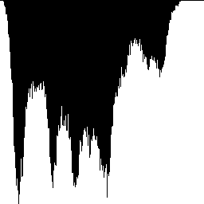 |

</details>

### [Histogram Equalization](./histogram_equalization/README.md)
Equalize grayscale histogram on a **grayscale** 24-bit BMP (`lena256.bmp`, B=G=R) to enhance contrast.

<details>
<summary>More</summary>

| Input                   | Output                       |
| ----------------------- | ---------------------------- |
|  |  |

</details>

### [Mean Filter](./mean_filter/README.md)
Read image from BMP (bitmap) file, and then use mean filter to blur image.

<details>
<summary>More</summary>

| Input                         | Output (filter size: 3) |
| ----------------------------- | ----------------------- |
|  |  |

</details>

### [Median Filter](./median_filter/README.md)
Read image with salt and pepper noise from BMP (bitmap) file, and then use median filter to remove noise.

<details>
<summary>More</summary>

| Input                         | Output (filter size: 3) |
| ----------------------------- | ----------------------- |
|  |  |

</details>

### [Gaussian Blur Filter](./gaussian_blur_filter/README.md)
Apply a 3×3 Gaussian blur **separately on B, G, and R**; output is a **color** 24-bit BMP.

<details>
<summary>More</summary>

| Input                   | Output (3×3 Gaussian)        |
| ----------------------- | ---------------------------- |
|  | 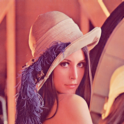 |

</details>

### [Sobel Filter](./sobel_filter/README.md)
Detect edges with Sobel operator on a grayscale image.

<details>
<summary>More</summary>

| Input                   | Output                       |
| ----------------------- | ---------------------------- |
| 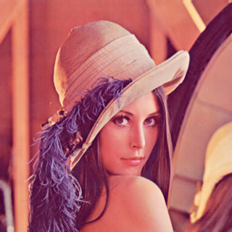 | 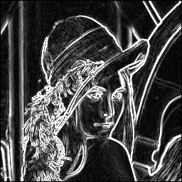 |

</details>

### [Laplacian Filter](./laplacian_filter/README.md)
Detect edges with 3x3 Laplacian operator on a grayscale image.

<details>
<summary>More</summary>

| Input                   | Output (3×3 Laplacian)       |
| ----------------------- | ---------------------------- |
|  | 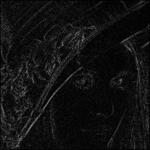 |

</details>

## RAM arbitration note

- **`planar_bgr` / `planar_gray`**: each planar `BMP_LWORD_RAM` port is muxed with priority **LOAD (byte write) → algorithm (byte write) → merge (address only, `wen=0`)** so only one writer drives the plane per cycle.
- **Other Verilog demos** (e.g. mean filter, Sobel): a single input buffer uses **`load_done ? algo_ram_addr : load_ram_addr`** (and disables load word-enables after load). That is the same *sequential load then algorithm* idea without planar merge.

## Quick Test
**`run_all_content_rtl.sh`** runs, for each module in order: C build and run, **RTL** simulation (**`make vs_rtl`** with VCS by default, or **`make ivl_rtl`** / **`make irun_rtl`**), and `compare.py` when present. **`--rtl-tool`** accepts **`vcs`** (default, runs **`vs_rtl`**), **`vs`** (alias for **`vcs`**), **`ivl`** (Icarus), or **`irun`**. The name **`iverilog`** is accepted as an alias for **`ivl`** (including `RTL_TOOL=iverilog` in the environment).

**`run_all_content_gate.sh`** does the same flow with **gate-level** simulation only: **`make vcs_gate`** or **`make irun_gate`**. **`--rtl-tool`** must be **`vcs`** (default) or **`irun`** (no Icarus gate target).

Place test assets under each module (e.g. `lena256.bmp`, `raw_to_bgr/lena256_rgb.raw`). If `median_filter/lena256_noise.bmp` is missing, the scripts try to generate it with `add_noise.py` from `lena256.bmp`. On failure, they print how many steps failed and a list of them.

```shell
cd Image_Processing_in_C_and_Verilog

# RTL (default: vcs → make vs_rtl)
./run_all_content_rtl.sh
./run_all_content_rtl.sh --rtl-tool vs
./run_all_content_rtl.sh --rtl-tool ivl
./run_all_content_rtl.sh --rtl-tool irun
RTL_TOOL=ivl ./run_all_content_rtl.sh
RTL_TOOL=irun ./run_all_content_rtl.sh

# Gate (default: vcs → make vcs_gate)
./run_all_content_gate.sh
./run_all_content_gate.sh --rtl-tool irun
RTL_TOOL=irun ./run_all_content_gate.sh

# C only: skip simulation and compare.py
./run_all_content_rtl.sh --skip-rtl
./run_all_content_gate.sh --skip-rtl
RUN_RTL=0 ./run_all_content_rtl.sh

# Single module only (directory name, e.g. median_filter)
./run_all_content_rtl.sh --only median_filter
./run_all_content_gate.sh --only median_filter

# Usage
./run_all_content_rtl.sh --help
./run_all_content_gate.sh --help
```

### Batch synthesis (Design Compiler)
`run_all_content_syn.sh` runs **`make syn`** in each module’s `RTL/` directory, in the same order as [Contents](#contents). This invokes Synopsys **Design Compiler** (`dc_shell` + `syn.tcl` per module). It does **not** run C, simulation, or `compare.py`. On failure, the script prints the failure count and a list (same style as `run_all_content_rtl.sh`).

```shell
cd Image_Processing_in_C_and_Verilog

./run_all_content_syn.sh
./run_all_content_syn.sh --only binarization
./run_all_content_syn.sh --help
```

## Image Processing Flow
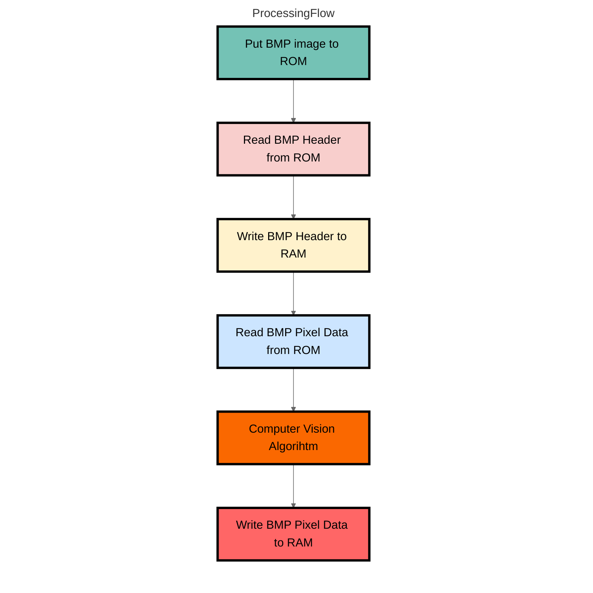
```mermaid
%%{
  init: {
    'theme': 'neutral',
    'themeVariables': {
      'textColor': '#000000',
      'noteTextColor' : '#000000',
      'fontSize': '20px'
    }
  }
}%%

flowchart LR
    b0[                  ] --- b2[ ] --- b4[ ] --- ProcessingFlow --- b1[ ] --- b3[ ] --- b5[                  ]
    style b0 stroke-width:0px, fill: #FFFFFF00, color:#FFFFFF00
    style b1 stroke-width:0px, fill: #FFFFFF00
    style b2 stroke-width:0px, fill: #FFFFFF00
    style b3 stroke-width:0px, fill: #FFFFFF00
    style b4 stroke-width:0px, fill: #FFFFFF00
    style b5 stroke-width:0px, fill: #FFFFFF00, color:#FFFFFF00

    linkStyle 0 stroke-width:0px
    linkStyle 1 stroke-width:0px
    linkStyle 2 stroke-width:0px
    linkStyle 3 stroke-width:0px
    linkStyle 4 stroke-width:0px
    linkStyle 5 stroke-width:0px
    
    subgraph ProcessingFlow
    direction TB
    style ProcessingFlow fill:#ffffff00, stroke-width:0px

    direction TB
        A[Put BMP image to ROM]
        A --> B[Read BMP Header from ROM]
        B --> C[Write BMP Header to RAM]
        C --> D[Read BMP Pixel Data from ROM]
        D --> E[Computer Vision Algorihtm]
        E --> F[Write BMP Pixel Data to RAM]
        style A fill:#74c2b5,stroke:#000000,stroke-width:4px
        style B fill:#f8cecc,stroke:#000000,stroke-width:4px
        style C fill:#fff2cc,stroke:#000000,stroke-width:4px
        style D fill:#cce5ff,stroke:#000000,stroke-width:4px
        style E fill:#fa6800,stroke:#000000,stroke-width:4px
        style F fill:#ff6666,stroke:#000000,stroke-width:4px
    end
```

## Tools
### C Compiler
* GNU Compiler Collection

### Image comparison
* Python3

### RTL simulation & debug
* Synopsys VCS (`make vs_rtl` in each module’s `RTL/`)
* Icarus Verilog (`make ivl_rtl`)
* Cadence irun (`make irun_rtl`)
* Synopsys Verdi
* GTKWave

### Synthesis and Verification
* Synopsys Design Compile

### Process
* TSMC 0.13µm (Not provide in this repository)