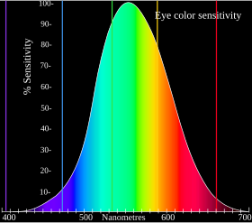

# BGR to Gray
Read image from BMP (bitmap) file, and then convert it (BGR image) to grayscale.

| Input                   | Output                       |
| ----------------------- | ---------------------------- |
|  |  |

## Usage
```shell
# C
$ cd ./bgr_to_gray/C
$ make
$ ./bgr2gray.o ../lena256.bmp

# RTL
$ cd ./bgr_to_gray/RTL
$ make check
$ make simulate
$ make wave

# Confirm whether the two BMP images are the same
$ cd ./bgr_to_gray
$ python3 compare.py
```

## BGR to Grayscale Conversion
Since humans have different sensitivity to colors, RBG will be converted using different weights.



Here's a colorbar we may want to convert:


If we convert it using an equally weighted:
```math
Gray = (B + G + R) / 3
```

we get a conversion that doesn't match our perceptions of the given colors:


If we convert it using NTSC formula:
```math
Gray = B*0.114 + G*0.587 + R*0.299
```

