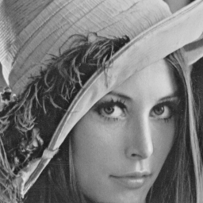

# BGR to Gray
Read image from BMP (bitmap) file , and then convert it (BGR image) to grayscale.

| Input                   | Output                       |
| ----------------------- | ---------------------------- |
|  |  |

## Usage
```shell
# C
$ cd ./bgr_to_gray/C
$ make
$ ./bgr2gray.o ../lena256.bmp

# Verilog
$ make check
$ make simulate
$ make wave
```

## BGR to Grayscale Conversion
NTSC formula:
```math
Gray = B*0.114 + G*0.587 + R*0.299
```