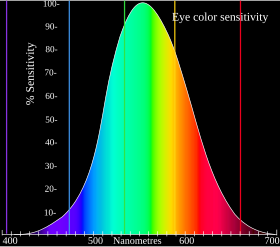

# BGR to Gray
Read image from BMP (bitmap) file, and then convert it (BGR image) to grayscale.

| Input                   | Output                  |
| ----------------------- | ----------------------- |
|  |  |

## Principle
**Grayscale / luma** approximates perceived brightness from three channels. This project uses **ITU-R BT.601–style luma weights** on BGR samples (B is first byte in BMP order):

```math
Y = 0.114\,B + 0.587\,G + 0.299\,R
```

The output BMP keeps **B = G = R = Y** for each pixel. See **BGR to Grayscale Conversion** below for intuition and comparisons.

## Usage
```shell
# C
$ cd ./bgr_to_gray/C
$ make
$ ./bgr2gray.o ../lena256.bmp

# RTL
$ cd ./bgr_to_gray/RTL
$ make ivl_rtl
$ make gtk_wave

# Compare C vs RTL
$ cd ./bgr_to_gray
$ python3 compare.py
```

*C writes `C/output.bmp`; RTL writes `RTL/output.bmp`.*

## BGR to Grayscale Conversion
Since humans have different sensitivity to colors, RBG will be converted using different weights.



Here's a colorbar we may want to convert:


If we convert it using an equally weighted:
```math
Gray = (B + G + R) / 3
```

we get a conversion that doesn't match our perceptions of the given colors:


If we convert it using NTSC formula:
```math
Gray = B*0.114 + G*0.587 + R*0.299
```


