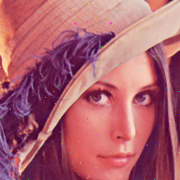

# Median Filter
Read image with salt and pepper noise from BMP (bitmap) file, and then use median filter to remove noise.

| Input                         | Output (filter size: 3)          |
| ----------------------------- | -------------------------------- |
|  |  |

## Usage
```shell
# Generate lena image with salt and pepper noise
$ cd ./median_filter
$ python3 add_noise.py 

# C
$ cd ./median_filter/C
$ make
$ ./median_filter.o ../lena256_noise.bmp 3 # set the size of median filter to 3

# RTL
$ cd ./median_filter/RTL
$ make check
$ make simulate
$ make wave

# Confirm whether the two BMP images are the same
$ cd ./median_filter
$ python3 compare.py 
```