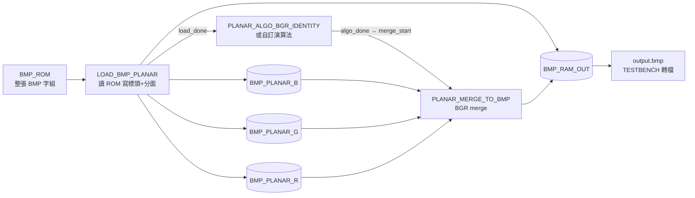

# Planar BGR buffer（lena256.bmp 設計流程）

輸入為 **24 bpp BMP**（檔案內像素位元組順序為 **B、G、R**，常說的「RGB BMP」在記憶體／檔案層仍是 BGR interleave）。本專案示範標準管線：**ROM 存整張圖 → 平面化寫入三顆通道 SRAM →（可選）演算法模組 → 合併回 interleaved BGR → 輸出 RAM → 寫成 `output.bmp`**。

## 資料流（RTL 對應）



- **LOAD_BMP_PLANAR**：從 ROM 讀取，把 **檔頭** 以 byte 寫入 `BMP_RAM_OUT`，同時把 **影像本體** 依像素拆成 **B / G / R** 三個平面，寫入 `BMP_PLANAR_{B,G,R}`。
- **PLANAR_ALGO_BGR_IDENTITY**：預設在 `load_done` 後對 B→G→R 各平面做 **identity 位元組寫回**（驗證與 LOAD／MERGE 的 **位址／寫使能多工**：`LOAD > ALGO > MERGE 讀`）。完成後進入 **DONE** 再拉高 **`algo_done`** 接 **`merge_start`**，避免最後一筆演算法寫入與 MERGE 讀取衝突。若只要零延遲邊界，可改例化 **`PLANAR_ALGO_PASSTHROUGH`**（`algo_done = load_done`）。
- **PLANAR_MERGE_TO_BMP**：依像素索引同時讀三平面，依 **B、G、R** 順序寫回 `BMP_RAM_OUT` 的影像區（與 BMP 檔案位元組序一致）。
- **TESTBENCH**：模擬結束後從 `BMP_RAM_OUT` 逐 byte 寫出 **`output.bmp`**。

## 驗證

RTL 建議用 Synopsys VCS：`make vs_rtl`（見 `RTL/Makefile`）。Icarus：`make ivl_rtl`。

```shell
cd ./planar_bgr/C && make && ./planar_bgr.o ../lena256.bmp
cd ../RTL && make vs_rtl
cd .. && python3 compare.py
```

Golden 與 `compare.py` 仍以 C 參考程式為準；目前 RTL 為 **identity**（輸出應與輸入一致）。
